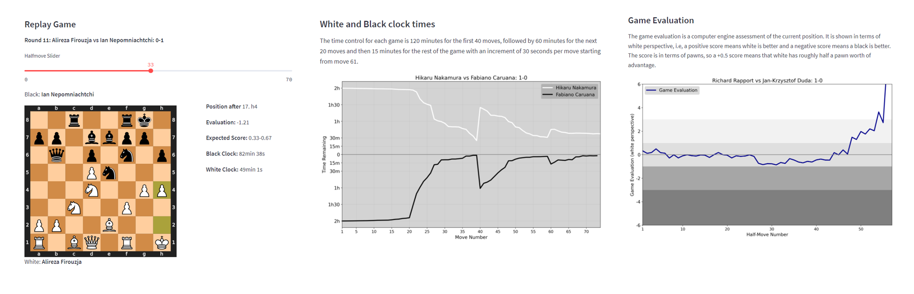

# FIDE Candidates Tournament 2022
 Streamlit app to analyze the 2022 FIDE Candidates Tournament games.
 
 For each of the 56 games, the app allows to user to:
 
- Replay the game.
- See white and black clock trajectories.
- See the game evaluation.
- Get some piece-action statistics. For example, how long a player thought during a game before moving a certain piece?

 
 
 Link to app: https://share.streamlit.io/tiagotvv/fide_candidates/main/candidates.py
 
 The PGN file used was downloaded from lichess.org at https://lichess.org/api/broadcast/kAvAGI7N.pgn and annotated by https://lichess.org/@/loepare: 

